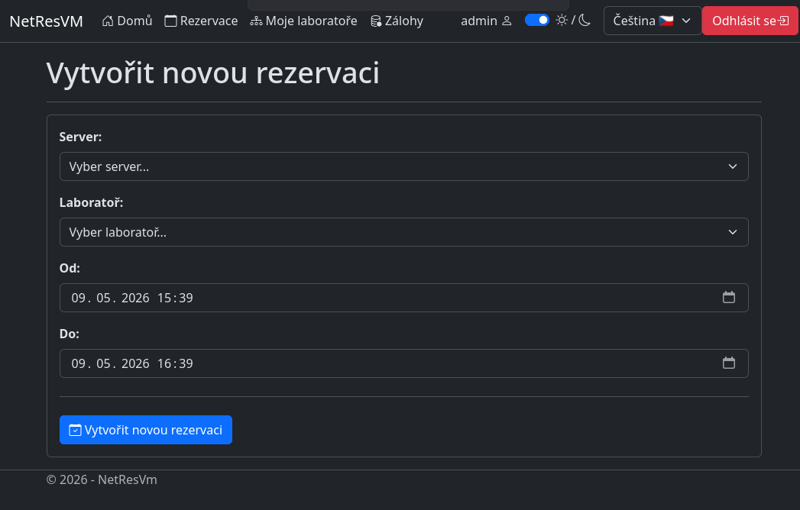
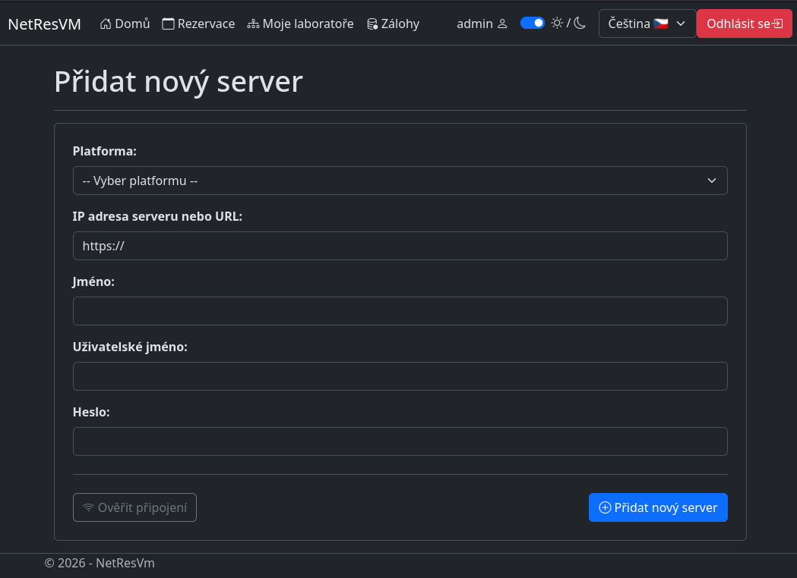
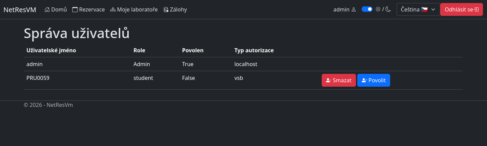
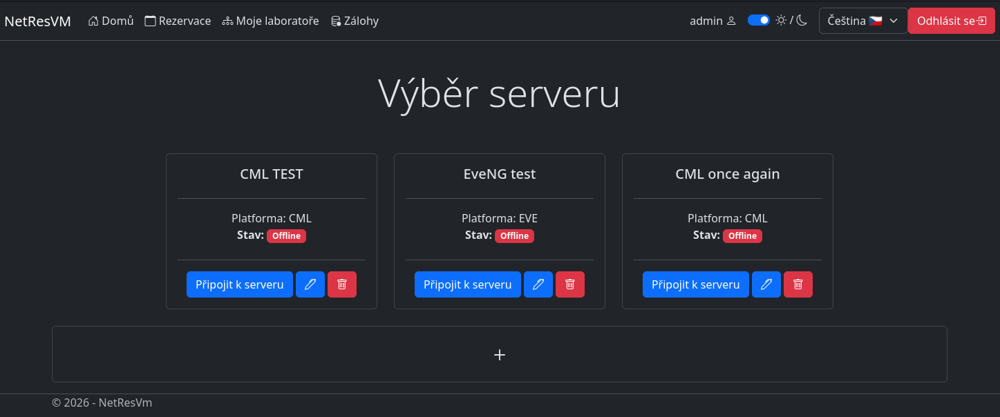
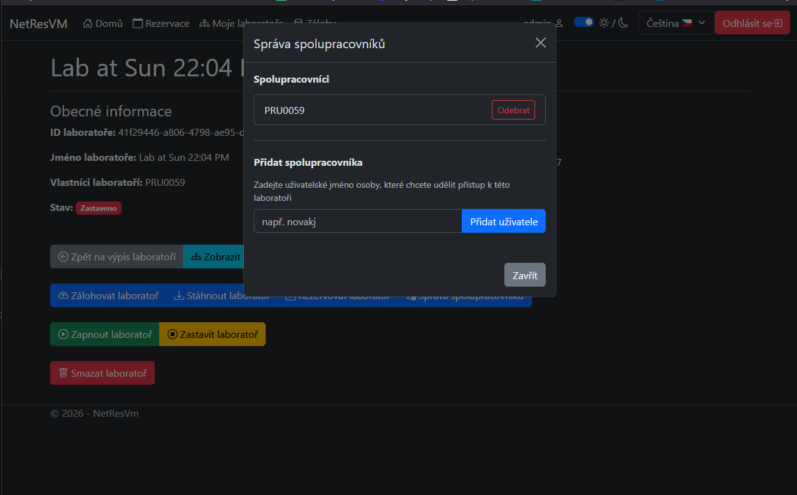

# NetResVM
[](https://github.com/maty5302/NetResVM/actions/workflows/tests.yml)
[](https://github.com/maty5302/NetResVM/actions/workflows/docker.yml)

🇬🇧 [English](README.md)
🇨🇿 [Čeština](README.cs.md)

Tento systém slouží studentům ke správě rezervací laboratorních prostředí (Cisco CML a EVE-NG), umožňuje vytváření a obnovování záloh a usnadňuje koordinaci mezi uživateli. Aplikace je navržena s důrazem na jednoduchost, bezpečnost a efektivitu.

## Licence

Tento projekt je dostupný pod licencí [GNU GPL v3](LICENSE).

## Systémové požadavky
- Přístup k serverům CML a EVE-NG
- Operační systém Linux nebo Windows
- Docker
- .NET 10.0 Runtime
- ASP.NET 10.0 Runtime
- Microsoft SQL Server 2022
- libldap-2.5-0 pro LDAP autentizaci (pouze Linux)

## Instalace pomocí Dockeru (doporučeno)
> Poznámka: Pro instalaci v Dockeru nepotřebujete výše uvedené požadavky kromě Dockeru.

#### 1. Stáhněte a nainstalujte Docker
#### 2. Stáhněte soubor [docker-compose.yml](docker/docker-compose.yml)  ze složky assets
#### 3. Vytvořte soubor [.env](docker/.env.example) s následujícím obsahem
> Zvolte si vlastní silné heslo pro databázi

```
DB_USER=sa
DB_PASSWORD=vase_silne_heslo
```

#### 4. Spusťte docker-compose.yml a počkejte cca 1-2 minuty.
Linux
```
docker compose pull && docker compose up
```

#### 5. Aplikace bude obvykle dostupná na adrese http://localhost:8080/ a můžete se přihlásit pomocí výchozího loginu admin a hesla Password123.

> Poznámka: Po prvním přihlášení byste měli změnit heslo za silnější!!!

## Instalace bez Dockeru 

#### 1. Stáhněte a rozbalte archiv pro váš operační systém

#### 2. Před pokračováním je potřeba nainstalovat všechny systémové požadavky pomocí správce balíčků.
```
mssql-server
mssql-tools
unixodbc-dev (linux only)
dotnet-sdk-10.0
aspnetcore-runtime-10.0
dotnet-runtime-10.0
libldap 2.5-0 nebo openldap 2.5-0 (linux-only)
```
#### 3. Vytvoření tabulek databáze 
Po instalaci všech balíčků se ujistěte, že běží MS SQL Server a že máte nainstalované mssql-tools. Poté spusťte následující příkaz pro vytvoření tabulek v databázi:
```
sqlcmd -S IPaddress -U Username -P "YourPassword" -i SQLCreateTablesBc.sql
```
#### 4. Nastavení připojení
Ve složce aplikace najděte soubor sqlconnection.json a vyplňte údaje pro připojení.

```
{
  "DataSource": "",
  "UserID": "",
  "Password": ""
}
```

### 5. Spuštění aplikace
Linux
```bash
chmod +x NetResVM
./NetResVM
```

Windows
```powershell
.\NetResVM.exe
```

## Funkce

### Automatické spouštění a vypínání serverů

Systém automaticky spustí rezervovaný laboratorní server krátce před začátkem rezervace a po jejím skončení jej vypne. Tím šetří prostředky serveru a zajišťuje plynulý provoz.

### Vytváření rezervací

Uživatelé mohou vytvářet rezervace virtuálních laboratorních prostředí (Cisco CML nebo EVE-NG) výběrem požadovaného data, časového slotu a serveru. Rezervační systém zajišťuje, že nedochází ke konfliktům, a zobrazuje aktuální dostupnost v reálném čase.

1. V hlavním menu klikněte nahoře na Rezervace
2. Vytvořte rezervaci
3. Vyplňte formulář a klikněte na vytvořit rezervaci



### Zálohování laboratoří

Uživatelé mohou vytvářet snapshoty (zálohy) svých aktivních laboratorních prostředí. Tyto zálohy lze stáhnout nebo uložit na server a později obnovit bez ztráty dat.

1. Vyberte server a následně laboratoř, kterou chcete zálohovat
2. Klikněte na vytvořit zálohu
3. Po vytvoření zálohy budete přesměrováni na stránku se seznamem všech záloh

### Přiřazení laboratoře

1. Vyberte server a následně laboratoř, kterou si chcete přiřadit
2. Klikněte na vlastnit laboratož

Poté ji uvidíte na stránce moje laboratoře, kde je můžete také spouštět a vypínat.

### Přidávání a odebírání připojení k CML a EVE-NG serverům

Administrátoři mohou přidávat nové CML nebo EVE-NG servery do systému zadáním údajů pro připojení, jako je IP adresa, metoda autentizace a typ serveru. Servery lze také odebírat. To zajišťuje škálovatelnost a flexibilitu při správě laboratorní infrastruktury.

1. Na hlavní stránce je tlačítko + pro přidání nového serveru
2. Vyplňte formulář a klikněte na přidat server

Mazání lze provést z hlavní stránky a pro úpravu serveru slouží tlačítko, které vás přesměruje na formulář s předvyplněnými informacemi o serveru.



### Správa uživatelů

Administrátoři systému mají možnost spravovat uživatelské účty. To zahrnuje vytváření, úpravy, dočasnou deaktivaci a mazání uživatelských profilů.

1. Na jakékoliv stránce klikněte na své uživatelské jméno, čímž se dostanete do nastavení
2. Pro vytvoření uživatele slouží formulář a pro správu existujících uživatelů tlačítko správa uživatelů
3. Kliknutím na toto tlačítko se dostanete na stránku správy uživatelů, kde můžete uživatele smazat nebo deaktivovat/aktivovat



### Výběr serveru se stavem Online

Dashboard pro výběr serveru slouží jako hlavní vstupní bod pro uživatele k připojení do virtualizačních prostředí (Cisco CML nebo EVE-NG). Poskytuje přehled všech registrovaných serverů ve formě přehledných karet.

* **Monitoring stavu v reálném čase:** Každá karta serveru zobrazuje dynamický stav `Online` nebo `Offline`, který je získáván pomocí asynchronních ping kontrol na pozadí, aby se zabránilo připojování k nefunkčním serverům.
* **Identifikace platformy:** Okamžitě rozpozná použitou virtualizační platformu (např. CML nebo EVE) pro každý server.
* **Rychlé administrativní akce:** Administrátoři mají přímý přístup k úpravě konfigurace nebo odstranění serverového připojení přímo z přehledu pomocí intuitivních ikon.
* **Plynulá navigace:** Hlavní tlačítko „Connect to server“ přesměruje uživatele přímo do laboratorního prostředí vybraného serveru.
* **Snadné rozšíření:** Speciální široké tlačítko ve spodní části umožňuje administrátorům rychle přidávat nové serverové připojení do infrastruktury.



### Správa spolupracovníků v laboratoři
Uživatelé, kteří vlastní laboratoř, mohou pozvat další registrované uživatele ke spolupráci na svých síťových topologiích. Tato funkce je ideální pro skupinové projekty a týmové úkoly, protože umožňuje více studentům sdílet přístup ke stejnému laboratornímu prostředí, spravovat jeho stav (spustit/zastavit) a hladce spolupracovat během vyhrazených časových úseků.

1. Přejděte do podrobností laboratoře, kterou vlastníte.

2. Klikněte na tlačítko „Spravovat spolupracovníky“ (nebo podobnou ikonu sdílení) u konkrétní laboratoře, kterou chcete sdílet.

3. Vyhledejte požadovaného uživatele podle jeho uživatelského jména a kliknutím jej přidejte jako spolupracovníka.

4. Chcete-li po dokončení společné práce odebrat přístup, stačí kliknout na tlačítko „Odstranit“ vedle jména stávajícího spolupracovníka ve stejném menu.

> Ve výchozím nastavení může spolupracovníky přidávat nebo odebírat uživatel, který laboratoř vlastní jako první.


