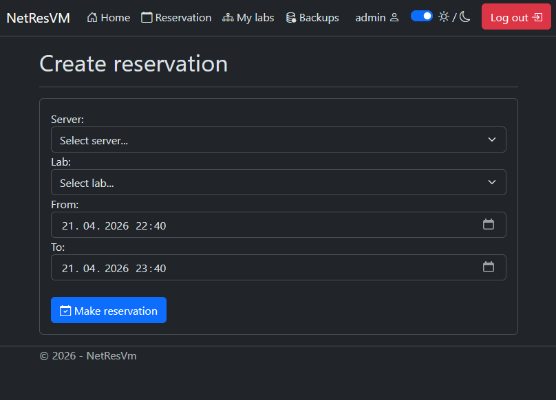
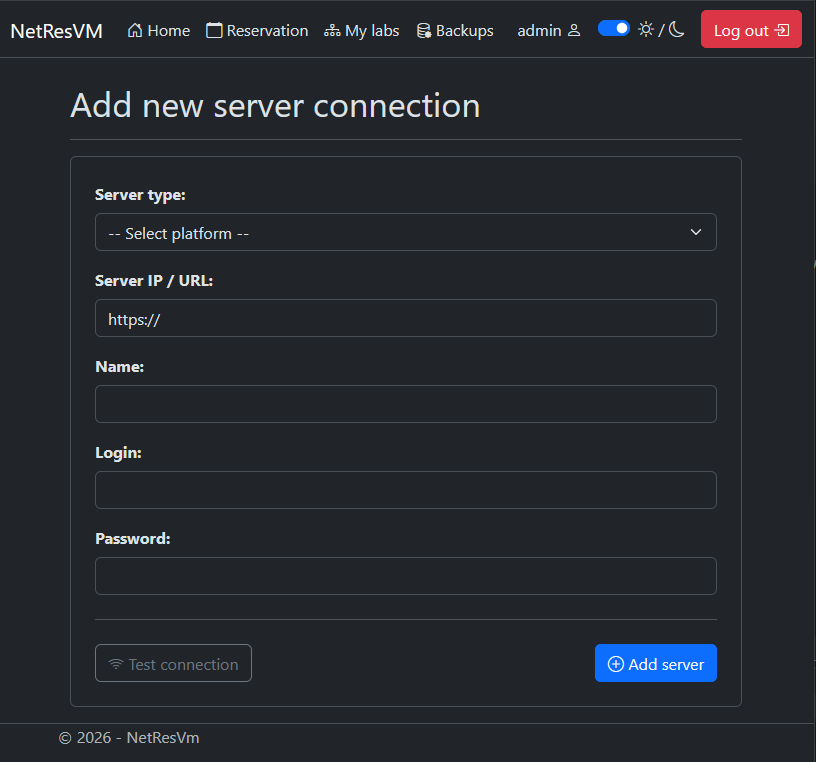
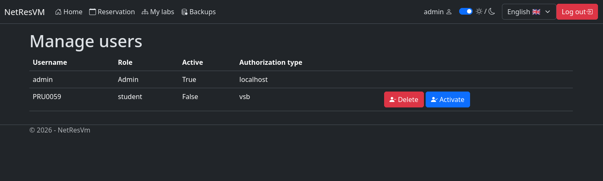
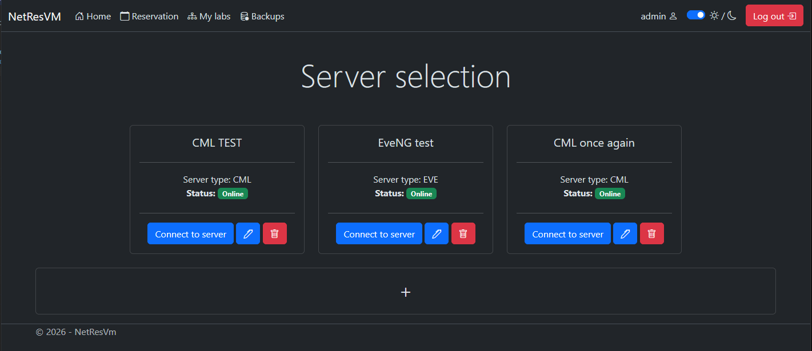
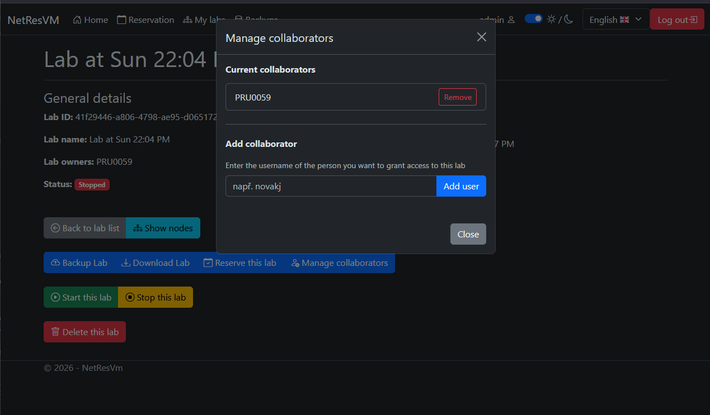

# NetResVM
[](https://github.com/maty5302/NetResVM/actions/workflows/tests.yml)
[](https://github.com/maty5302/NetResVM/actions/workflows/docker.yml)

🇬🇧 [English](README.md)
🇨🇿 [Čeština](README.cs.md)

This system is used by students to manage reservations of lab environments (Cisco CML and EVE-NG), allows backups to be created and restored, and facilitates coordination between users. The application is designed with simplicity, security, and efficiency in mind.

## License

This project is available under the [GNU GPL v3](LICENSE) license.

## System requirements
- Access to CML and EVE-NG servers
- Operating system Linux or Windows
- Docker 
- .NET 10.0 Runtime
- ASP.NET 10.0 Runtime
- Microsoft SQL Server 2022
- libldap-2.5-0 for LDAP auth (Linux only)

## Installation Docker (Recommended)
> Note: for installation in docker you don't need requirements from above except from Docker.
#### 1. Download and install Docker
#### 2. Download [docker-compose.yml](docker/docker-compose.yml) from assets folder
#### 3. Create [.env](docker/.env.example) file with following
> Choose your own strong password for database
```
DB_USER=sa
DB_PASSWORD=vase_silne_heslo
```
#### 4. Run docker-compose.yml and wait for about 1-2 minutes.
Linux CLI
```
docker compose pull && docker compose up
```


#### 5. You can use the app usually hosted on http://localhost:8080/ and sign in with default login=admin and password=Password123.
>Note after first login you should change the password for a stronger one!!!


## Installation without Docker
#### 1. Download and unzip archive for your operating system

#### 2. Install packages

Need to install all system requirements with your package manager before getting to next step.

```bash
mssql-server
mssql-tools
unixodbc-dev
dotnet-sdk-10.0
aspnetcore-runtime-10.0
dotnet-runtime-10.0
libldap 2.5-0 or openldap 2.5-0
```
#### 3. Create tables in database
 After installing all packages make sure your MS SQL Server is running and have installed mssql-tools. You need to run following command to insert tables to database. 
```bash
sqlcmd -S IPaddress -U Username -P "YourPassword" -i SQLCreateTablesBc.sql
```

#### 4. Setup connection

In app directory find a file called `sqlconnection.json` and fill all connection information.

```json
{
  "DataSource": "",
  "UserID": "",
  "Password": ""
}
```

#### 5. Run application

Linux
```bash
chmod +x NetResVM
./NetResVM
```

Windows
```powershell
.\NetResVM.exe
```

## Features

### Automatic starting and stopping servers

The system automatically starts the reserved laboratory server shortly before the reservation begins and shuts it down after the reservation ends. This saves server resources and ensures smooth operation.

### Creating reservation

Users can create reservations for virtual lab environments (Cisco CML or EVE-NG) by selecting the desired date, time slot, and server. The reservation system ensures there are no conflicts and displays current availability in real-time.

1. From main menu click on topbar Reservation
2. Create reservation
3. Fill the form and click make reservation



### Backups of laboratory

Users can create snapshots (backups) of their active lab environments. These backups can be downloaded or stored on the server and later restored to continue work without data loss.

1. Select server and after that laboratory you want to backup
2. Click on make a backup
3. After making backup you will be forwarded to page for viewing all backups.

### Assign laboratory

1. Select server and after that laboratory you want to assign to yourself
2. Click on own a lab

After that you can see it in My labs page and you can start and stop the lab as well. 

### Adding and removing CML and EVE-NG server connection
Administrators can add new CML or EVE-NG servers into the system by providing connection details such as IP address, authentication method, and server type. Servers can also be removed. This ensures scalability and flexibility in managing lab infrastructure.

1. From main page there is a + button for adding new server
2. Fill the form and click add server

Deleting can be done from main page and for editing server there is a button that redirect to form with filled information about server. 


### Managing users
System administrators have the ability to manage user accounts. This includes creating, editing, temporarily disabling and deleting user profiles. 

1. From any page click on your username that takes you to settings page
2. For creating user there is form and for managing existing users there is button manage users
3. Clicking on that button takes you to manage users page where you can either delete or deactivate/activate user. 



### Server selection with Online status
The Server Selection dashboard acts as the main entry point for users to connect to their virtualization environments (Cisco CML or EVE-NG). It provides a clear, card-based overview of all registered servers.

* **Real-time Status Monitoring:** Each server card displays a dynamic `Online` or `Offline` status badge, powered by asynchronous background ping checks to prevent users from attempting to connect to dead servers.
* **Platform Identification:** Instantly identifies the underlying virtualization platform (e.g., CML or EVE) for each node.
* **Quick Administrative Actions:** Admins have direct access to edit configurations or delete server connections directly from the grid using intuitive icon buttons.
* **Seamless Navigation:** A primary "Connect to server" button routes the user directly to the selected server's lab environment.
* **Easy Expansion:** A dedicated, full-width action area at the bottom allows administrators to quickly add new server connections to the infrastructure.



### Managing collaborators of lab
Users who own a laboratory can invite other registered users to collaborate on their network topologies. This feature is ideal for group projects and team assignments, allowing multiple students to share access to the same lab environment, manage its state (start/stop), and work together seamlessly during reserved time slots.

1. Navigate to the details of lab you own.

2. Click on the "Manage Collaborators" (or similar share icon) button on a specific lab you want to share.

3. Search for the desired user by their username, and click to add them as a collaborator.

4. To revoke access once the joint work is finished, simply click the remove button next to an existing collaborator's name in the same menu.

> By default user who owns lab first can add or remove collaborators.

