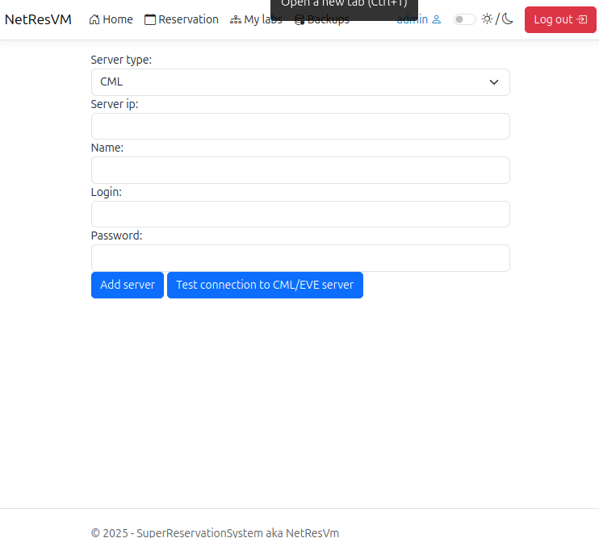

# NetResVM

This system is used by students to manage reservations of lab environments (Cisco CML and EVE-NG), allows backups to be created and restored, and facilitates coordination between users. The application is designed with simplicity, security, and efficiency in mind.

## License

This project is available under the [GNU GPL v3](LICENSE) license.

## System requirements
- Operating system Linux or Windows
- .NET 8.0 Runtime
- ASP.NET 8.0 Runtime
- Microsoft SQL Server 2022
- libldap-2.5-0 for LDAP auth (Linux only)
- Access to CML and EVE-NG servers

## Installation
#### 1. Download and unzip archive for your operating system
#### 2. Run install.sh or install.ps1

Run script for installing dependencies and requirements (Select version of MS SQL 2022 Express). Install script install.sh is tested for Ubuntu 22.04 and newer. If you don't have this distro go to 2. Alternative.

Linux
```bash
chmod +x install-ubuntu.bash
sudo ./install-ubuntu.bash
```

Windows (Run as administrator)
```powershell
Set-ExecutionPolicy unrestricted
.\install.ps1
```
>  Make sure to change default password and make account for MS SQL Server by seeing and running `SQLCommnadAfterInstall.sql`

#### 2. Alternative -  Not supported linux distro

Need to install all system requirements with your package manager before getting to next step.

```bash
mssql-server
mssql-tools
unixodbc-dev
dotnet-sdk-8.0
aspnetcore-runtime-8.0
dotnet-runtime-8.0
libldap 2.5-0 or openldap 2.5-0
```

 After installing all packages make sure your MS SQL Server is running and have installed mssql-tools. You need to run following command to insert tables to database. 
```bash
sqlcmd -S IPaddress -U Username -P "YourPassword" -i SQLCreateTablesBc.sql
```

#### 3. Setup connection

In app directory find a file called `sqlconnection.json` and fill all connection information.

```json
{
  "DataSource": "",
  "UserID": "",
  "Password": ""
}
```

#### 4. Run application

Linux
```bash
chmod +x SuperReservationSystem
./SuperReservationSystem
```

Windows
```powershell
.\SuperReservationSystem.exe
```

## Features

### Automatic starting and stopping servers

The system automatically starts the reserved laboratory server shortly before the reservation begins and shuts it down after the reservation ends. This saves server resources and ensures smooth operation.

### Creating reservation

Users can create reservations for virtual lab environments (Cisco CML or EVE-NG) by selecting the desired date, time slot, and server. The reservation system ensures there are no conflicts and displays current availability in real-time.

1. From main menu click on topbar Reservation
2. Create reservation
3. Fill the form and click make reservation


### Backups of laboratory

Users can create snapshots (backups) of their active lab environments. These backups can be downloaded or stored on the server and later restored to continue work without data loss.

1. Select server and after that laboratory you want to backup
2. Click on make a backup
3. After making backup you will be forwarded to page for viewing all backups.

### Assign laboratory

1. Select server and after that laboratory you want to assign to yourself
2. Click on own a lab

After that you can see it in My labs page and you can start and stop the lab as well. 

### Adding and removing CML and EVE-NG server connection
Administrators can add new CML or EVE-NG servers into the system by providing connection details such as IP address, authentication method, and server type. Servers can also be removed. This ensures scalability and flexibility in managing lab infrastructure.

1. From main page there is a + button for adding new server
2. Fill the form and click add server

Deleting can be done from main page and for editing server there is a button that redirect to form with filled information about server. 


### Managing users
System administrators have the ability to manage user accounts. This includes creating, editing, temporarily disabling and deleting user profiles. 

1. From any page click on your username that takes you to settings page
2. For creating user there is form and for managing existing users there is button manage users
3. Clicking on that button takes you to manage users page where you can either delete or deactivate/activate user. 

